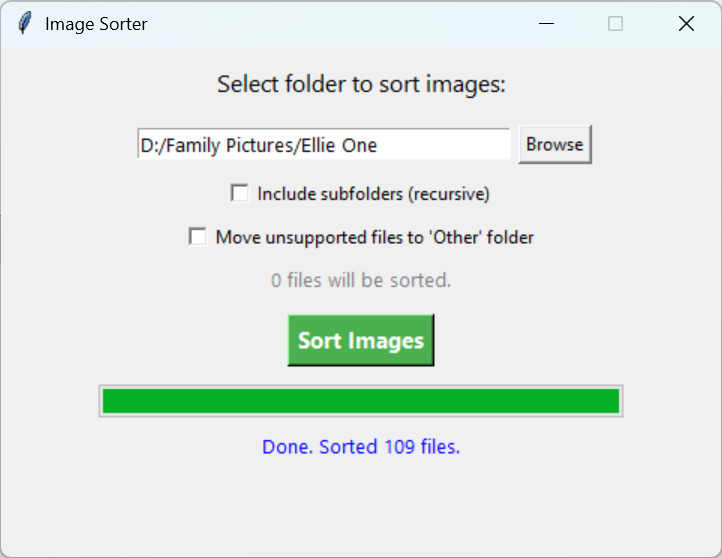

# CR3 and JPG Sorter


**Version 2.0.0 released! Major overhaul with a new GUI, more formats, and installer support.**

This project sorts camera image files into organized folders by file type, with a simple desktop GUI and PowerShell script.

## Features
- Sorts images by type (CR3, JPG, NEF, etc.) into corresponding folders.
- Supports many DSLR/mirrorless camera formats (CR2, CR3, NEF, ARW, DNG, TIFF, etc.).
- **Custom file extensions** - Add your own file types via configuration.
- Optionally moves unsupported files to an 'Other' folder.
- Recursive sorting (with skip for already sorted folders).
- **Preview mode** - See what will be moved before executing.
- **Background threading** - GUI remains responsive during operations.
- **Cancel button** - Stop sorting at any time.
- Progress bar, file count preview, and robust error handling.
- **Comprehensive logging** - All operations logged to file for troubleshooting.
- **Configuration management** - Remembers your preferences and last used folder.
- Modular Python code (GUI and core logic separated).
- Windows installer with Start Menu and desktop shortcut support.

## Quick Start (Python GUI)
1. **Requirements:** Python 3.8+ (Tkinter is included with standard Python).
2. **Run the app:**
   ```
   python ImageSorterGUI_v3.py
   ```
3. **Usage:**
   - Click 'Browse' to select a folder.
   - (Optional) Check 'Include subfolders (recursive)' to sort recursively.
   - (Optional) Check 'Move unsupported files to Other folder'.
   - Click 'Preview' to see what will be moved (recommended first time).
   - Click 'Sort Images' to perform the sort operation.
   - Use 'Cancel' to stop if needed.
   - Check `logs/` folder for detailed operation logs.

## Configuration
The app stores preferences in `config.json`:
- Last used folder
- Checkbox states (recursive, move_other)
- Window size and position
- Custom file extensions

To add custom file extensions, edit `config.json` and add to the `custom_extensions` array:
```json
{
  "custom_extensions": [".heic", ".webp"]
}
```

## Packaging as an .exe
- Install PyInstaller:
  ```
  pip install pyinstaller
  ```
- Build the executable:
  ```
  pyinstaller --onefile --windowed --icon=icon.ico ImageSorterGUI.py
  ```
- The `.exe` will be in the `dist/` folder.

## Creating a Windows Installer
- Use Inno Setup to create a professional installer with Start Menu and desktop shortcut support.
- See the documentation or ask for a sample script.

## PowerShell Script
- `CR3andJPGMover.ps1`: Moves CR3 and JPG/JPEG files into `CR3` and `JPG` subfolders, respectively.

## Tests
- Run the test script:
  ```
  python test_sorter.py
  ```

## Contributing
See [CONTRIBUTING.md](CONTRIBUTING.md).

## Changelog
See [CHANGELOG.md](CHANGELOG.md).

## Screenshots

### Main Window


### Sorting Progress


---

