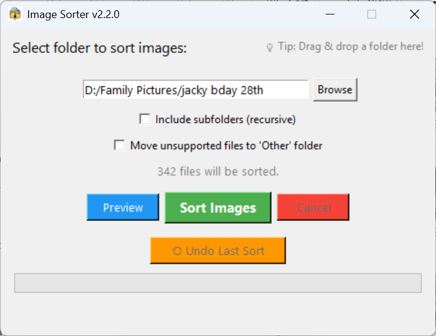
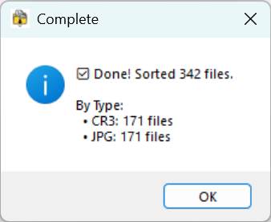
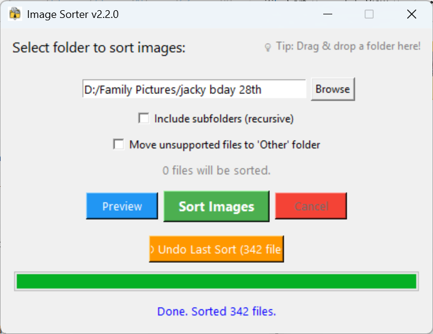

# Version 2.2.0 - UX Enhancements

## 🎉 What's New

This release focuses on **user experience** with 3 major quality-of-life improvements based on user feedback:

### ✨ New Features

#### ⟲ Undo/Rollback System
- **One-click undo** of your last sort operation
- Button shows **number of files** that can be reversed
- Safely handles edge cases (files moved elsewhere, deleted, etc.)
- Transaction log tracks every file move
- Perfect safety net for trying the app on important photos

#### 🎯 Drag & Drop Support
- **Drop folders directly** onto the window
- No more clicking through folder dialogs
- Visual hint at top: "💡 Tip: Drag & drop a folder here!"
- Faster workflow for power users
- Gracefully falls back if library not available

#### 📊 Statistics Dashboard
- **Detailed breakdown** by file type after each sort
- See exactly how many CR3, JPG, NEF, etc. were sorted
- Shows skipped files (if any)
- Stats persist in the GUI between operations
- Also displayed in completion dialog

---

## 📸 Screenshots

### Main Window with New Features


### Statistics Dashboard


### Undo Ready


---

## 🚀 Quick Start

**Download:** `ImageSorterSetup.exe` (below)

**New in this version:**
1. **Drag & drop** your photo folder onto the window
2. Click **Sort Images**
3. View **statistics** showing breakdown by type
4. Use **Undo** button if you want to reverse

---

## 📦 Installation

**For Users:**
- Download and run `ImageSorterSetup.exe`
- Installer handles everything automatically

**For Developers:**
```bash
pip install tkinterdnd2
python ImageSorterGUI_v4.py
```

---

## 🔄 Upgrading from v2.1.0

- Fully backward compatible
- All your preferences preserved
- New undo functionality available immediately
- Drag & drop works out of the box

---

## 💡 Tips & Tricks

1. **Try before you commit:** Use Preview mode first, then sort
2. **Undo is your friend:** Made a mistake? Just click Undo!
3. **Drag & drop:** Fastest way to select folders
4. **Check stats:** See what types of files you have
5. **Recursive mode:** Enable to sort subfolders too

---

## 🐛 Known Issues

- Windows may show "Unknown Publisher" warning (click "More info" → "Run anyway")
- Drag & drop requires `tkinterdnd2` library (included in installer)
- Transaction log cleared after successful undo

---

## 📊 Technical Details

**New Modules:**
- `TransactionManager.py` - Undo/rollback system
- `ImageSorterGUI_v4.py` - Enhanced GUI

**Dependencies:**
- Added: `tkinterdnd2>=0.3.0` for drag & drop

**Code Quality:**
- Fully type-annotated
- Comprehensive error handling
- ~400 new lines of production code

---

## 📝 Full Changelog

### Added
- Undo/Rollback system with transaction tracking
- Drag & Drop support for folders
- Statistics Dashboard with breakdown by type
- 3 new screenshots

### Changed
- GUI updated to v4
- Enhanced completion dialog
- Window size: 520x480
- Improved visual feedback

### Technical
- TransactionManager module
- Updated ImageSorterCore with transaction recording
- Updated .gitignore for transaction files

---

## 🔜 What's Next?

Planned for future releases:
- Duplicate detection
- Custom output directory
- EXIF data integration
- Batch rename capability

---

## 🙏 Feedback

Please report issues or suggest features on [GitHub Issues](https://github.com/24Skater/CR3_JPG_Sorter/issues).

---

## 🎊 Thank You!

Thanks for using ImageSorter! This release makes sorting your photos safer, faster, and more informative.

**Enjoy v2.2.0! 🎉**

